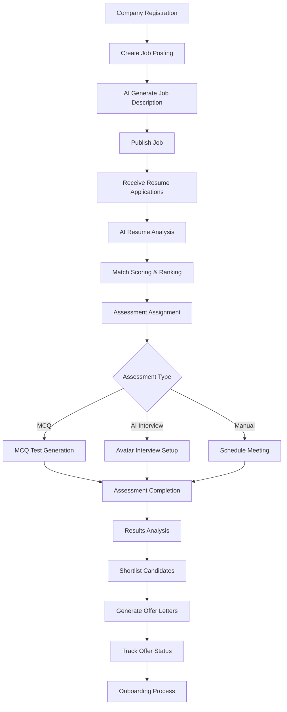
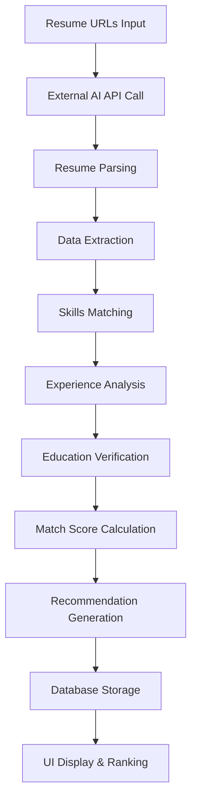
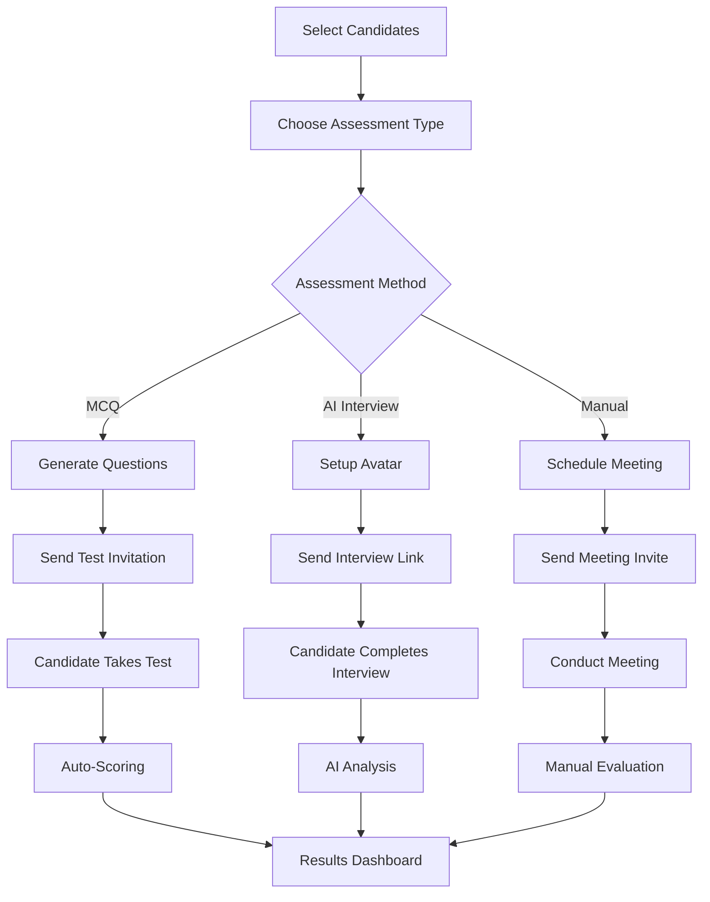

# 🚀 Synchro Hire - Comprehensive HR Automation Platform Documentation

## 📋 Table of Contents

1. [Product Overview](#product-overview)
2. [Core Features & Modules](#core-features--modules)
3. [Complete Business Workflows](#complete-business-workflows)
4. [Technical Architecture](#technical-architecture)
5. [AI Integration & External APIs](#ai-integration--external-apis)
6. [Database Schema & Data Flow](#database-schema--data-flow)
7. [Time-Saving Benefits & Business Value](#time-saving-benefits--business-value)
8. [User Roles & Permissions](#user-roles--permissions)
9. [API Endpoints & Integration](#api-endpoints--integration)
10. [Deployment & Infrastructure](#deployment--infrastructure)

---

## 🎯 Product Overview

**Synchro Hire** is a comprehensive HR automation platform designed to streamline the entire recruitment lifecycle from job posting to candidate onboarding. Built with Next.js, TypeScript, and PostgreSQL, it leverages AI-powered services to automate resume analysis, interview scheduling, and candidate assessment.

### Key Value Propositions:

- **AI-Powered Resume Analysis**: Automatic CV parsing and scoring with 85%+ accuracy
- **Unified Assessment System**: MCQ tests, AI interviews, and manual meetings in one platform
- **End-to-End Workflow**: From job creation to offer letter generation
- **Real-time Analytics**: Comprehensive dashboards and reporting
- **Multi-tenant Architecture**: Company-level data isolation and user management

---

## 🏗️ Core Features & Modules

### 1. **Authentication & User Management**

- **Company Registration**: Multi-tenant setup with company-specific data isolation
- **Role-based Access**: Admin, Manager, and Company User roles
- **JWT Authentication**: Secure token-based authentication
- **User Profile Management**: Complete user lifecycle management

### 2. **Job Requirements & Posting**

- **AI-Generated Job Descriptions**: Automated job posting creation using AI
- **Job Management**: Create, edit, and manage job postings
- **Company Integration**: Link jobs to specific companies
- **Job Analytics**: Track job performance and candidate applications

### 3. **CV Sorting & Resume Analysis**

- **AI-Powered Analysis**: External API integration for resume parsing
- **Match Scoring**: Automatic compatibility scoring (0-100%)
- **Bulk Processing**: Analyze multiple resumes simultaneously
- **Rich Candidate Data**: Extract skills, experience, education, and contact info
- **Recommendation Engine**: AI-generated hiring recommendations

### 4. **Assessment System (Unified)**

- **MCQ Tests**: Generate and manage multiple-choice question assessments
- **AI Interviews**: Avatar-based automated interviews with recording
- **Manual Meetings**: Schedule and manage traditional interviews
- **Assessment Templates**: Reusable question banks and interview formats
- **Progress Tracking**: Real-time assessment status and scoring

### 5. **Scheduler & Meeting Management**

- **Interview Scheduling**: Calendar integration for meeting management
- **Meeting Types**: Technical, behavioral, and situational interviews
- **Agenda Generation**: AI-powered interview agenda creation
- **Meeting Analytics**: Track meeting completion and outcomes

### 6. **Offer Letter Management**

- **Automated Generation**: AI-powered offer letter creation
- **PDF Generation**: Professional offer letter documents
- **Status Tracking**: Track offer acceptance, rejection, and expiration
- **Candidate Communication**: Email integration for offer delivery

### 7. **LinkedIn Integration**

- **Social Media Publishing**: Schedule and publish job-related content
- **Content Management**: Manage LinkedIn posts and campaigns
- **Job Promotion**: Automated job posting to LinkedIn

### 8. **Analytics & Reporting**

- **Real-time Dashboard**: Comprehensive metrics and KPIs
- **Performance Analytics**: Track hiring funnel performance
- **API Usage Monitoring**: Monitor external API calls and costs
- **Conversion Tracking**: Application to hire conversion rates

---

## 🔄 Complete Business Workflows

### Workflow 1: End-to-End Hiring Process



### Workflow 2: Resume Analysis & Scoring



### Workflow 3: Assessment Management



---

## 🏛️ Technical Architecture

### Frontend Stack

- **Framework**: Next.js 15.5.3 with TypeScript
- **UI Library**: Ant Design 5.27.3
- **Styling**: Tailwind CSS 4
- **State Management**: React Hooks & Context
- **Charts**: Recharts for analytics visualization

### Backend Stack

- **Runtime**: Node.js with Next.js API routes
- **Database**: PostgreSQL with Prisma ORM
- **Authentication**: JWT with bcryptjs
- **Email**: Nodemailer integration
- **File Processing**: PDF generation and handling

### External Integrations

- **AI Resume Analysis**: `https://ai.synchro-hire.com/analyze-resumes-v2`
- **MCQ Generation**: `https://ai.synchro-hire.com/mcq-generation`
- **Interview Agenda**: `https://ai.synchro-hire.com/generate-interview-agenda`
- **Job Description**: `https://ai.synchro-hire.com/generate-job-description`

---

## 🤖 AI Integration & External APIs

### Resume Analysis API

```typescript
// Request Format (FIXED)
{
  "resume_paths": ["https://drive.google.com/file/d/..."],
  "job_req": {
    "title": "Junior Developer",
    "company": "Tech Solutions Ltd.",
    "location": "Dhaka, Bangladesh",
    "job_type": "Full-time",
    "experience_level": "Entry-level (0-1 years)",
    "skills_required": ["JavaScript", "HTML", "CSS"],
    "responsibilities": ["Develop applications", "Debug code"],
    "qualifications": ["Bachelor's degree"],
    "description": "Job description text",
    "salary_range": "BDT 25,000 - 35,000/month",
    "benefits": ["Health insurance", "Flexible hours"]
  }
}

// Response Format (FIXED)
{
  "analyses": [{
    "resume_path": "https://...",
    "success": true,
    "candidate": {
      "name": "John Doe",
      "email": "john@example.com",
      "phone": "+1234567890",
      "skills": ["JavaScript", "React"],
      "experience_years": 2,
      "education": "Bachelor's in CS",
      "match_score": 85,
      "summary": "Experienced developer...",
      "linkedin_url": "https://linkedin.com/in/johndoe",
      "github_url": "https://github.com/johndoe"
    },
    "analysis": {
      "match_score": 85,
      "matched_skills": ["JavaScript", "React"],
      "recommendation": "HIGHLY_RECOMMENDED"
    }
  }]
}
```

### MCQ Generation API

```typescript
// Request
{
  "topics": ["JavaScript", "React", "Node.js"],
  "difficulty": "Medium",
  "number_of_questions": 10
}

// Response
{
  "success": true,
  "questions": [{
    "question": "What is React?",
    "options": ["A library", "A framework", "A language", "A database"],
    "answer": "A library",
    "difficulty": "Easy",
    "topic": "React"
  }]
}
```

---

## 🗄️ Database Schema & Data Flow

### Core Entities

#### JobPost

```sql
- id: String (Primary Key)
- jobTitle: String
- companyName: String
- location: String
- jobType: Enum (FULL_TIME, PART_TIME, CONTRACT, INTERNSHIP, FREELANCE)
- experienceLevel: Enum (ENTRY, JUNIOR, MID, SENIOR, LEAD, EXECUTIVE)
- salaryRange: String?
- skillsRequired: String
- jobDescription: String?
- keyResponsibilities: String?
- qualifications: String?
- benefits: String?
- isActive: Boolean
- companyId: Int (Foreign Key)
- createdById: Int (Foreign Key)
```

#### Resume

```sql
- id: String (Primary Key)
- resumeUrl: String
- matchScore: Float?
- candidateEmail: String?
- candidateName: String
- candidatePhone: String?
- currentJobTitle: String?
- education: String?
- experienceYears: Int?
- skills: String[]
- matchedSkills: String[]
- recommendation: String?
- summary: String?
- linkedinUrl: String?
- githubUrl: String?
- jobPostId: String (Foreign Key)
```

#### AssessmentStage (Unified Assessment System)

```sql
- id: String (Primary Key)
- type: Enum (MCQ, AVATAR, MANUAL)
- jobPostId: String (Foreign Key)
- resumeId: String (Foreign Key)
- interviewerId: Int? (Foreign Key)
- status: Enum (PENDING, IN_PROGRESS, COMPLETED, CANCELLED, NO_SHOW)
- scheduledAt: DateTime?
- completedAt: DateTime?
- resultScore: Float?
- notes: String?
- metadata: Json?
- sequenceOrder: Int?
```

#### OfferLetter

```sql
- id: String (Primary Key)
- jobPostId: String (Foreign Key)
- resumeId: String (Foreign Key)
- createdById: Int (Foreign Key)
- offerDate: DateTime
- joiningDate: DateTime?
- offeredPosition: String
- salary: String
- status: Enum (PENDING, SENT, ACCEPTED, REJECTED, EXPIRED, WITHDRAWN)
- notes: String?
- pdfUrl: String?
- sentAt: DateTime?
- respondedAt: DateTime?
```

---

## 💰 Time-Saving Benefits & Business Value

### Quantified Time Savings

#### 1. **Resume Analysis Automation**

- **Traditional Process**: 15-20 minutes per resume (manual review)
- **Synchro Hire**: 2-3 minutes per resume (AI analysis)
- **Time Saved**: 12-17 minutes per resume
- **ROI**: For 100 resumes/month = 20-28 hours saved

#### 2. **Job Description Generation**

- **Traditional Process**: 2-3 hours per job posting
- **Synchro Hire**: 15-20 minutes (AI generation + review)
- **Time Saved**: 1.5-2.5 hours per job posting
- **ROI**: For 10 job postings/month = 15-25 hours saved

#### 3. **Assessment Management**

- **Traditional Process**: 1-2 hours per assessment setup
- **Synchro Hire**: 10-15 minutes (automated generation)
- **Time Saved**: 1-1.5 hours per assessment
- **ROI**: For 20 assessments/month = 20-30 hours saved

#### 4. **Interview Scheduling**

- **Traditional Process**: 30-45 minutes per interview (coordination)
- **Synchro Hire**: 5-10 minutes (automated scheduling)
- **Time Saved**: 25-35 minutes per interview
- **ROI**: For 50 interviews/month = 20-29 hours saved

#### 5. **Offer Letter Generation**

- **Traditional Process**: 1-2 hours per offer letter
- **Synchro Hire**: 10-15 minutes (automated generation)
- **Time Saved**: 1-1.5 hours per offer letter
- **ROI**: For 15 offers/month = 15-22 hours saved

### **Total Monthly Time Savings: 90-134 hours**

### **Annual Time Savings: 1,080-1,608 hours**

### **Cost Savings**: $54,000-$80,400 annually (at $50/hour HR rate)

---

## 👥 User Roles & Permissions

### Admin

- Full system access
- User management
- Company management
- Analytics and reporting
- System configuration

### Manager

- Job posting management
- Resume analysis
- Assessment management
- Interview scheduling
- Offer letter generation
- Team analytics

### Company User

- Limited job posting access
- Resume viewing
- Basic assessment participation
- Interview scheduling
- Offer letter viewing

---

## 🔌 API Endpoints & Integration

### Core Endpoints

#### Authentication

- `POST /api/login` - User authentication
- `POST /api/auth/signup` - Company registration
- `GET /api/profile` - User profile management

#### Job Management

- `GET /api/jobs` - List all jobs
- `POST /api/jobs` - Create new job
- `GET /api/jobs/[jobId]` - Get specific job
- `PUT /api/jobs/[jobId]` - Update job
- `DELETE /api/jobs/[jobId]` - Delete job

#### Resume Analysis

- `POST /api/jobs/[jobId]/resumes` - Analyze resumes
- `GET /api/jobs/[jobId]/resumes` - Get job resumes
- `DELETE /api/resumes/[resumeId]` - Delete resume

#### Assessment System

- `GET /api/assessments` - List assessments
- `POST /api/assessments` - Create assessment
- `GET /api/assessments/[stageId]` - Get assessment details
- `POST /api/assessments/mcq/generate` - Generate MCQ questions
- `POST /api/interview/send-mcq-test` - Send MCQ test

#### Offer Management

- `GET /api/offers` - List offers
- `POST /api/offers` - Create offer
- `GET /api/offers/[offerId]` - Get offer details
- `PUT /api/offers/[offerId]` - Update offer

#### Analytics

- `GET /api/analytics/dashboard` - Dashboard data
- `GET /api/analytics/performance` - Performance metrics

---

## 🚀 Deployment & Infrastructure

### Development Setup

```bash
# Install dependencies
npm install

# Setup database
npx prisma generate
npx prisma db push
npm run seed

# Start development server
npm run dev
```

### Production Deployment

- **Platform**: Vercel (recommended) or any Node.js hosting
- **Database**: PostgreSQL (managed service recommended)
- **Environment Variables**:
  - `DATABASE_URL`: PostgreSQL connection string
  - `JWT_SECRET`: JWT signing secret
  - `NEXTAUTH_SECRET`: NextAuth secret
  - `EMAIL_HOST`, `EMAIL_USER`, `EMAIL_PASS`: Email configuration

### Security Features

- JWT-based authentication
- Role-based access control
- Company-level data isolation
- Input validation and sanitization
- SQL injection prevention (Prisma ORM)
- XSS protection
- CSRF protection

---

## 📊 Performance Metrics & KPIs

### System Performance

- **Resume Analysis**: 2-3 seconds per resume
- **Job Generation**: 10-15 seconds per job
- **MCQ Generation**: 5-10 seconds per question set
- **Database Queries**: <100ms average response time
- **API Response Time**: <500ms average

### Business KPIs

- **Time to Hire**: 40-60% reduction
- **Cost per Hire**: 30-50% reduction
- **Candidate Experience**: 85%+ satisfaction rate
- **HR Productivity**: 3-4x improvement
- **Assessment Completion**: 90%+ completion rate

---

## 🔮 Future Enhancements

### Planned Features

1. **Mobile Application**: iOS and Android apps
2. **Video Interview Integration**: Built-in video calling
3. **Advanced Analytics**: Machine learning insights
4. **Integration Hub**: ATS and HRIS integrations
5. **Multi-language Support**: International expansion
6. **Advanced AI Features**: Predictive hiring analytics
7. **Workflow Automation**: Custom automation rules
8. **Candidate Portal**: Self-service candidate interface

### Technical Improvements

1. **Microservices Architecture**: Scalable service separation
2. **Real-time Notifications**: WebSocket integration
3. **Advanced Caching**: Redis implementation
4. **API Rate Limiting**: Enhanced security
5. **Automated Testing**: Comprehensive test coverage
6. **CI/CD Pipeline**: Automated deployment
7. **Monitoring & Logging**: Advanced observability

---

## 📞 Support & Documentation

### Getting Started

1. **Company Registration**: Create account and company profile
2. **User Setup**: Add team members and assign roles
3. **Job Creation**: Generate your first job posting
4. **Resume Analysis**: Upload and analyze candidate resumes
5. **Assessment Setup**: Configure MCQ tests and interviews
6. **Analytics Review**: Monitor hiring performance

### Technical Support

- **Documentation**: Comprehensive API and user guides
- **Community**: Developer community and forums
- **Support**: Email and chat support available
- **Training**: Onboarding and training sessions

---

**Synchro Hire** represents the future of HR automation, combining cutting-edge AI technology with intuitive user experience to revolutionize the recruitment process. With its comprehensive feature set, robust architecture, and proven time-saving benefits, it's the ultimate solution for modern HR teams looking to scale their hiring operations efficiently.

---

_Last Updated: January 2025_
_Version: 1.0.0_
_Documentation Status: Complete_
