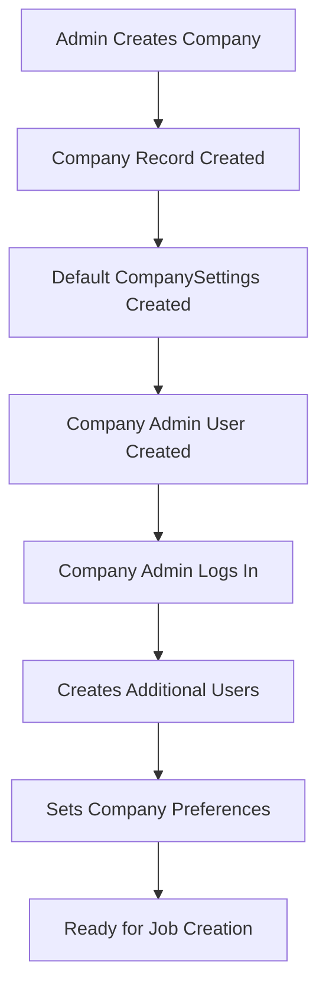
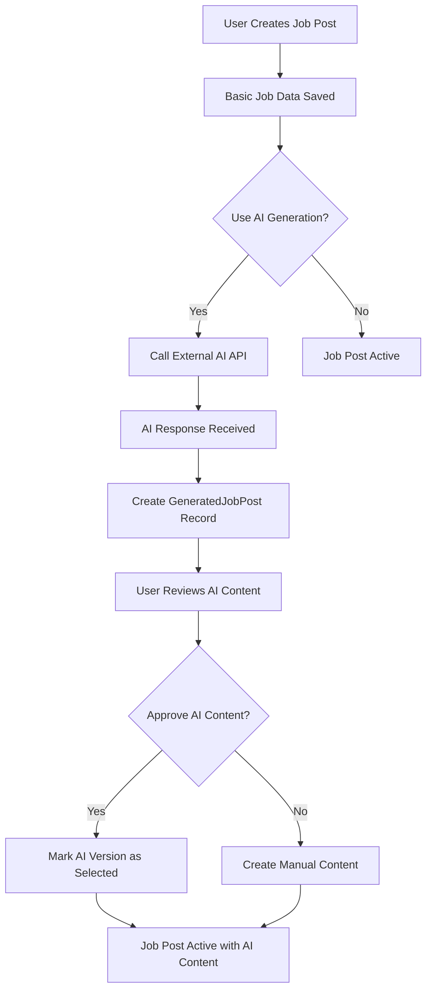
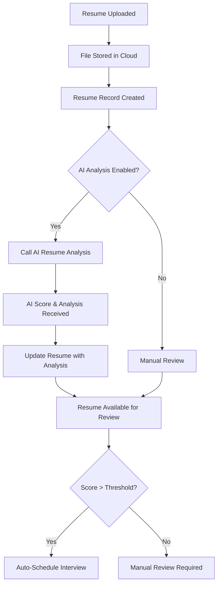
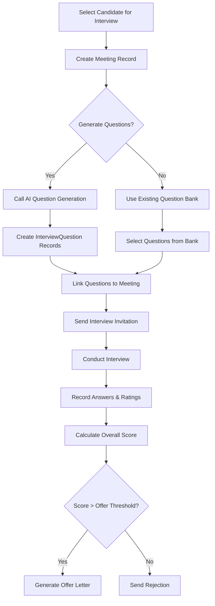
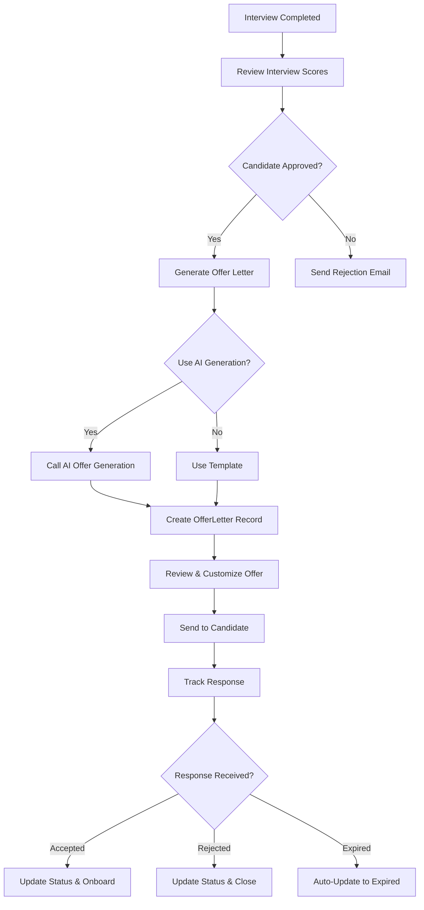
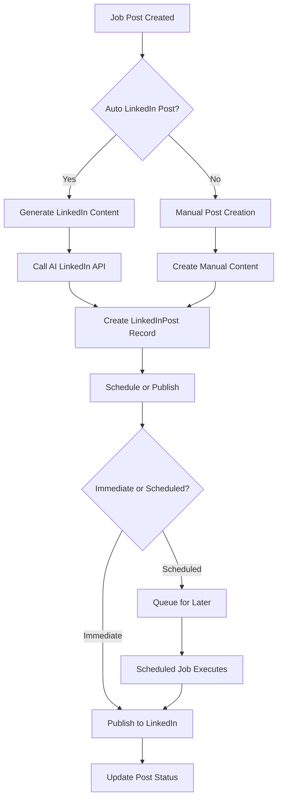

# Database Entity Relationship Diagram (ERD)

## HR Automation Application

### Table of Contents

1. [Current Database Schema](#current-database-schema)
2. [Proposed Database Schema](#proposed-database-schema)
3. [Entity Relationships](#entity-relationships)
4. [Business Logic & Constraints](#business-logic--constraints)
5. [Data Flow Workflows](#data-flow-workflows)
6. [Migration Strategy](#migration-strategy)

---

## Current Database Schema

### Entity Overview

```
┌─────────────┐    ┌─────────────┐    ┌─────────────┐    ┌─────────────┐
│   Company   │    │    User     │    │   JobPost   │    │   Resume    │
│             │    │             │    │             │    │             │
│ • id        │◄──┤ • companyId │    │ • companyId │◄──┤ • jobPostId │
│ • name      │    │ • email     │    │ • jobTitle  │    │ • resumeUrl │
│ • address   │    │ • type      │◄──┤ • createdBy │    │ • matchScore│
│ • country   │    │             │    │             │    │             │
└─────────────┘    └─────────────┘    └─────────────┘    └─────────────┘
                                               │                   │
                           ┌─────────────┐    │    ┌─────────────┐ │
                           │GeneratedJob │◄───┘    │   Meeting   │◄┘
                           │Post         │         │             │
                           │             │         │ • resumeId  │
                           │ • jobPostId │         │ • createdBy │
                           │ • content   │         │ • status    │
                           │ • version   │         │             │
                           └─────────────┘         └─────────────┘
```

### Current Entities

#### 1. Company

```sql
┌─────────────────────────────────────────────────────────────┐
│                         Company                             │
├─────────────────────────────────────────────────────────────┤
│ PK  id              : INT (Auto Increment)                  │
│ UK  companyUuid     : STRING (UUID)                         │
│     name            : STRING                                │
│     address         : STRING                                │
│     country         : STRING                                │
│     logo            : STRING? (Optional)                    │
│     mapLocation     : STRING? (Optional)                    │
│     linkedinProfile : STRING? (Optional)                    │
│     website         : STRING? (Optional)                    │
│     createdAt       : DATETIME                              │
│     updatedAt       : DATETIME                              │
└─────────────────────────────────────────────────────────────┘
```

#### 2. User

```sql
┌─────────────────────────────────────────────────────────────┐
│                           User                              │
├─────────────────────────────────────────────────────────────┤
│ PK  id        : INT (Auto Increment)                        │
│ UK  email     : STRING                                      │
│     name      : STRING                                      │
│     password  : STRING (Hashed)                             │
│     type      : ENUM (ADMIN, MANAGER, COMPANY_USER)         │
│ FK  companyId : INT? (References Company.id)                │
│     createdAt : DATETIME                                    │
│     updatedAt : DATETIME                                    │
└─────────────────────────────────────────────────────────────┘
```

#### 3. JobPost

```sql
┌─────────────────────────────────────────────────────────────┐
│                         JobPost                             │
├─────────────────────────────────────────────────────────────┤
│ PK  id                    : STRING (CUID)                   │
│     jobTitle              : STRING                          │
│     department            : STRING                          │
│     salaryRange           : STRING?                         │
│     keySkills             : STRING (Comma-separated)        │
│     location              : STRING                          │
│     jobType               : ENUM (JobType)                  │
│     experienceLevel       : ENUM (ExperienceLevel)          │
│     additionalRequirements: STRING?                         │
│     externalApiResponse   : JSON?                           │
│     isActive              : BOOLEAN (Default: true)         │
│ FK  companyId             : INT (References Company.id)     │
│ FK  createdById           : INT (References User.id)        │
│     createdAt             : DATETIME                        │
│     updatedAt             : DATETIME                        │
└─────────────────────────────────────────────────────────────┘
```

#### 4. GeneratedJobPost

```sql
┌─────────────────────────────────────────────────────────────┐
│                    GeneratedJobPost                         │
├─────────────────────────────────────────────────────────────┤
│ PK  id            : STRING (CUID)                           │
│     content       : TEXT                                    │
│     version       : INT (Default: 1)                       │
│     isSelected    : BOOLEAN (Default: false)               │
│     aiModel       : STRING?                                 │
│ FK  jobPostId     : STRING (References JobPost.id)         │
│ FK  generatedById : INT (References User.id)               │
│     generatedAt   : DATETIME                               │
│                                                             │
│ UK  (jobPostId, version) - Unique version per job post     │
└─────────────────────────────────────────────────────────────┘
```

#### 5. Resume

```sql
┌─────────────────────────────────────────────────────────────┐
│                          Resume                             │
├─────────────────────────────────────────────────────────────┤
│ PK  id         : STRING (CUID)                              │
│     resumeUrl  : STRING                                     │
│     name       : STRING?                                    │
│     email      : STRING?                                    │
│     matchScore : FLOAT?                                     │
│     jsonData   : JSON?                                      │
│ FK  jobPostId  : STRING (References JobPost.id)            │
│     createdAt  : DATETIME                                   │
└─────────────────────────────────────────────────────────────┘
```

#### 6. Meeting

```sql
┌─────────────────────────────────────────────────────────────┐
│                         Meeting                             │
├─────────────────────────────────────────────────────────────┤
│ PK  id             : STRING (CUID)                          │
│     meetingTime    : DATETIME                               │
│     meetingLink    : STRING?                                │
│     meetingSummary : TEXT?                                  │
│     meetingRating  : STRING?                                │
│     meetingType    : ENUM? (TECHNICAL, BEHAVIORAL, etc.)   │
│     agenda         : TEXT?                                  │
│     status         : ENUM (MeetingStatus)                   │
│     notes          : TEXT?                                  │
│ FK  resumeId       : STRING (References Resume.id)         │
│ FK  createdById    : INT (References User.id)              │
│     createdAt      : DATETIME                               │
│     updatedAt      : DATETIME                               │
└─────────────────────────────────────────────────────────────┘
```

#### 7. ApiLog

```sql
┌─────────────────────────────────────────────────────────────┐
│                         ApiLog                              │
├─────────────────────────────────────────────────────────────┤
│ PK  id           : STRING (CUID)                            │
│     functionName : STRING                                   │
│     companyName  : STRING?                                  │
│     invokedTime  : DATETIME                                 │
│     createdAt    : DATETIME                                 │
└─────────────────────────────────────────────────────────────┘
```

### Current Relationships

```
Company (1) ──────────────► (0..n) User
Company (1) ──────────────► (0..n) JobPost
User (1) ─────────────────► (0..n) JobPost [as creator]
User (1) ─────────────────► (0..n) GeneratedJobPost [as generator]
User (1) ─────────────────► (0..n) Meeting [as creator]
JobPost (1) ──────────────► (0..n) GeneratedJobPost
JobPost (1) ──────────────► (0..n) Resume
Resume (1) ───────────────► (0..n) Meeting
```

---

## Proposed Database Schema

### Enhanced Entity Overview

```
┌─────────────┐    ┌─────────────┐    ┌─────────────┐    ┌─────────────┐
│   Company   │    │    User     │    │   JobPost   │    │   Resume    │
│             │    │             │    │             │    │             │
│ • id        │◄──┤ • companyId │    │ • companyId │◄──┤ • jobPostId │
│ • name      │    │ • email     │    │ • jobTitle  │    │ • resumeUrl │
│ • settings  │    │ • type      │◄──┤ • createdBy │     │ • analysis  │
│             │    │             │    │             │    │             │
└─────────────┘    └─────────────┘    └─────────────┘    └─────────────┘
       │                   │                   │                   │
       │                   │                   ▼                   ▼
┌─────────────┐    ┌─────────────┐    ┌─────────────┐    ┌─────────────┐
│LinkedInPost │    │OfferLetter  │    │GeneratedJob │    │   Meeting   │
│             │    │             │    │Post         │    │             │
│ • companyId │    | • createdBy │    │ • jobPostId │    │ • resumeId  │
│ • content   │    | • resumeId  │◄──┤ • content  │      │ • questions │
│ • status    │    | • status    │    │ • version   │    │ • rating    │
└─────────────┘    └─────────────┘    └─────────────┘    └─────────────┘
                              ▲                                   │
                              │         ┌─────────────┐           │
                              └─────────┤InterviewQues│◄──────────┘
                                        │tion         │
                                        │ • type      │
                                        │ • difficulty│
                                        └─────────────┘
```

### New/Enhanced Entities

#### 8. OfferLetter (NEW)

```sql
┌─────────────────────────────────────────────────────────────┐
│                       OfferLetter                           │
├─────────────────────────────────────────────────────────────┤
│ PK  id               : STRING (CUID)                        │
│     candidateName    : STRING                               │
│     candidateEmail   : STRING                               │
│     position         : STRING                               │
│     salary           : STRING                               │
│     startDate        : DATETIME                             │
│     benefits         : TEXT?                                │
│     terms            : TEXT?                                │
│     generatedContent : TEXT? (AI-generated content)         │
│     status           : ENUM (OfferStatus)                   │
│     sentAt           : DATETIME?                            │
│     respondedAt      : DATETIME?                            │
│     expiresAt        : DATETIME?                            │
│ FK  jobPostId        : STRING (References JobPost.id)      │
│ FK  resumeId         : STRING (References Resume.id)       │
│ FK  createdById      : INT (References User.id)            │
│     createdAt        : DATETIME                             │
│     updatedAt        : DATETIME                             │
└─────────────────────────────────────────────────────────────┘

ENUM OfferStatus: PENDING, SENT, ACCEPTED, REJECTED, EXPIRED, WITHDRAWN
```

#### 9. InterviewQuestion (NEW)

```sql
┌─────────────────────────────────────────────────────────────┐
│                    InterviewQuestion                        │
├─────────────────────────────────────────────────────────────┤
│ PK  id           : STRING (CUID)                            │
│     question     : TEXT                                     │
│     questionType : ENUM (QuestionType)                      │
│     difficulty   : ENUM? (Difficulty)                       │
│     category     : STRING? (e.g., "JavaScript", "System")   │
│     aiGenerated  : BOOLEAN (Default: false)                │
│     isActive     : BOOLEAN (Default: true)                 │
│ FK  jobPostId    : STRING? (References JobPost.id)         │
│ FK  createdById  : INT (References User.id)                │
│     createdAt    : DATETIME                                 │
│     updatedAt    : DATETIME                                 │
└─────────────────────────────────────────────────────────────┘

ENUM QuestionType: TECHNICAL, BEHAVIORAL, SITUATIONAL, CUSTOM
ENUM Difficulty: EASY, MEDIUM, HARD
```

#### 10. MeetingQuestion (NEW) - Junction Table

```sql
┌─────────────────────────────────────────────────────────────┐
│                    MeetingQuestion                          │
├─────────────────────────────────────────────────────────────┤
│ PK  id         : STRING (CUID)                              │
│     answer     : TEXT?                                      │
│     rating     : INT? (1-10 scale)                          │
│     notes      : TEXT?                                      │
│ FK  meetingId  : STRING (References Meeting.id)            │
│ FK  questionId : STRING (References InterviewQuestion.id)  │
│                                                             │
│ UK  (meetingId, questionId) - Unique question per meeting  │
└─────────────────────────────────────────────────────────────┘
```

#### 11. LinkedInPost (NEW)

```sql
┌─────────────────────────────────────────────────────────────┐
│                       LinkedInPost                          │
├─────────────────────────────────────────────────────────────┤
│ PK  id          : STRING (CUID)                             │
│     content     : TEXT                                      │
│     postUrl     : STRING?                                   │
│     status      : ENUM (PostStatus)                         │
│     scheduledAt : DATETIME?                                 │
│     publishedAt : DATETIME?                                 │
│     aiGenerated : BOOLEAN (Default: false)                 │
│ FK  jobPostId   : STRING? (References JobPost.id)          │
│ FK  companyId   : INT (References Company.id)              │
│ FK  createdById : INT (References User.id)                 │
│     createdAt   : DATETIME                                  │
│     updatedAt   : DATETIME                                  │
└─────────────────────────────────────────────────────────────┘

ENUM PostStatus: DRAFT, SCHEDULED, PUBLISHED, FAILED
```

#### 12. CompanySettings (NEW)

```sql
┌─────────────────────────────────────────────────────────────┐
│                    CompanySettings                          │
├─────────────────────────────────────────────────────────────┤
│ PK  id                    : STRING (CUID)                   │
│     aiApiQuota            : INT (Default: 1000)             │
│     aiApiUsed             : INT (Default: 0)                │
│     defaultInterviewDuration: INT (Default: 60 minutes)     │
│     autoScheduleEnabled   : BOOLEAN (Default: false)        │
│     emailNotifications    : BOOLEAN (Default: true)         │
│     linkedinIntegration   : BOOLEAN (Default: false)        │
│     customBranding        : JSON?                           │
│ FK  companyId             : INT (References Company.id)     │
│     createdAt             : DATETIME                        │
│     updatedAt             : DATETIME                        │
└─────────────────────────────────────────────────────────────┘
```

### Enhanced Relationships (Proposed Schema)

```
Company (1) ──────────────► (0..n) User
Company (1) ──────────────► (0..n) JobPost
Company (1) ──────────────► (0..n) LinkedInPost
Company (1) ──────────────► (1) CompanySettings

User (1) ─────────────────► (0..n) JobPost [as creator]
User (1) ─────────────────► (0..n) GeneratedJobPost [as generator]
User (1) ─────────────────► (0..n) Meeting [as creator]
User (1) ─────────────────► (0..n) OfferLetter [as creator]
User (1) ─────────────────► (0..n) InterviewQuestion [as creator]
User (1) ─────────────────► (0..n) LinkedInPost [as creator]

JobPost (1) ──────────────► (0..n) GeneratedJobPost
JobPost (1) ──────────────► (0..n) Resume
JobPost (1) ──────────────► (0..n) OfferLetter
JobPost (1) ──────────────► (0..n) InterviewQuestion
JobPost (1) ──────────────► (0..n) LinkedInPost

Resume (1) ───────────────► (0..n) Meeting
Resume (1) ───────────────► (0..n) OfferLetter

Meeting (n) ──────────────► (n) InterviewQuestion [via MeetingQuestion]

InterviewQuestion (n) ────► (n) Meeting [via MeetingQuestion]
```

---

## Entity Relationships

### 1. Company-Centric Structure

```
Company
├── Users (Multiple employees/managers)
├── JobPosts (All job listings)
├── LinkedInPosts (Social media posts)
└── CompanySettings (Configuration)
```

### 2. Job-Centric Workflow

```
JobPost
├── GeneratedJobPost (AI versions)
├── Resume (Applications)
├── OfferLetter (Job offers)
├── InterviewQuestion (Question bank)
└── LinkedInPost (Promotion posts)
```

### 3. Candidate Journey

```
Resume → Meeting → MeetingQuestion → OfferLetter
   ↓        ↓           ↓              ↓
JobPost  Questions   Evaluation    Final Offer
```

### 4. User Access Patterns

```
ADMIN:
├── Full system access
├── All companies
└── System configuration

MANAGER:
├── Company-level access
├── All company job posts
├── Team management
└── Reports and analytics

COMPANY_USER:
├── Department-level access
├── Assigned job posts
├── Own interviews
└── Basic operations
```

---

## Business Logic & Constraints

### 1. Data Integrity Rules

#### User Constraints

```sql
-- Users can only belong to one company (except ADMIN)
-- ADMIN users can have companyId = NULL
-- Email must be unique across system
-- Password must be hashed (bcrypt)

CONSTRAINT user_company_check
  CHECK ((type = 'ADMIN' AND companyId IS NULL) OR
         (type IN ('MANAGER', 'COMPANY_USER') AND companyId IS NOT NULL))
```

#### JobPost Constraints

```sql
-- Job posts must belong to a company
-- Creator must belong to the same company
-- At least one skill must be specified
-- Salary range format validation

CONSTRAINT jobpost_creator_company_check
  CHECK (createdBy.companyId = companyId)

CONSTRAINT salary_range_format_check
  CHECK (salaryRange ~ '^\\$[0-9,]+ - \\$[0-9,]+$' OR salaryRange IS NULL)
```

#### Meeting Constraints

```sql
-- Meeting time must be in the future (when created)
-- Meeting duration should be reasonable (15 min - 8 hours)
-- Creator must have access to the resume's job post

CONSTRAINT meeting_future_time_check
  CHECK (meetingTime > createdAt)

CONSTRAINT meeting_duration_check
  CHECK (EXTRACT(EPOCH FROM (meetingTime + INTERVAL '8 hours')) >
         EXTRACT(EPOCH FROM meetingTime))
```

#### OfferLetter Constraints

```sql
-- Start date must be after offer creation
-- Expiry date must be after creation and before start date
-- Salary must be positive

CONSTRAINT offer_start_date_check
  CHECK (startDate > createdAt::date)

CONSTRAINT offer_expiry_check
  CHECK (expiresAt IS NULL OR
         (expiresAt > createdAt AND expiresAt::date < startDate))
```

### 2. Business Rules

#### AI API Usage Limits

```javascript
// Check quota before AI API calls
if (company.settings.aiApiUsed >= company.settings.aiApiQuota) {
  throw new Error("AI API quota exceeded");
}

// Increment usage after successful AI call
await updateCompanySettings(companyId, {
  aiApiUsed: company.settings.aiApiUsed + 1,
});
```

#### Resume Analysis Scoring

```javascript
// AI analysis score should be 0-100
// Scores above 80 are considered "highly matched"
// Scores below 40 are "poorly matched"

const scoreCategory = (score) => {
  if (score >= 80) return "HIGHLY_MATCHED";
  if (score >= 60) return "WELL_MATCHED";
  if (score >= 40) return "MODERATELY_MATCHED";
  return "POORLY_MATCHED";
};
```

#### Interview Question Bank Rules

```javascript
// Technical questions should have difficulty rating
// Behavioral questions are difficulty-agnostic
// Questions can be job-specific or general
// AI-generated questions should be reviewed before use

const validateQuestion = (question) => {
  if (question.type === "TECHNICAL" && !question.difficulty) {
    throw new Error("Technical questions must have difficulty rating");
  }

  if (question.aiGenerated && !question.reviewed) {
    question.isActive = false; // Require manual review
  }
};
```

#### Offer Letter Workflow

```javascript
// Offers can only be created for interviewed candidates
// Multiple offers can exist per candidate (for different positions)
// Offer expiry automatically updates status

const createOffer = async (data) => {
  // Check if candidate has completed interviews
  const interviews = await Meeting.findMany({
    where: { resumeId: data.resumeId, status: "COMPLETED" },
  });

  if (interviews.length === 0) {
    throw new Error("Candidate must complete interviews before offer");
  }

  return OfferLetter.create(data);
};
```

---

## Data Flow Workflows

### 1. Company Onboarding Workflow



```sql
-- Step 1: Create Company
INSERT INTO companies (name, address, country, website)
VALUES ('TechCorp Inc', '123 Main St', 'USA', 'techcorp.com');

-- Step 2: Create Default Settings
INSERT INTO company_settings (companyId, aiApiQuota, emailNotifications)
VALUES (LAST_INSERT_ID(), 1000, true);

-- Step 3: Create Company Admin
INSERT INTO users (email, name, password, type, companyId)
VALUES ('admin@techcorp.com', 'John Admin', 'hashed_password', 'ADMIN', LAST_INSERT_ID());
```

### 2. Job Creation & AI Enhancement Workflow



```javascript
// Workflow Implementation
const createJobWithAI = async (jobData, userId) => {
  // Step 1: Create basic job post
  const jobPost = await JobPost.create({
    ...jobData,
    createdById: userId,
    isActive: false, // Not active until content is finalized
  });

  // Step 2: Generate AI content (if requested)
  if (jobData.useAI) {
    const aiResponse = await callExternalAI("/create-job-post", jobData);

    // Step 3: Save AI-generated version
    const generatedPost = await GeneratedJobPost.create({
      jobPostId: jobPost.id,
      content: aiResponse.job_requirement,
      version: 1,
      aiModel: "gpt-4",
      generatedById: userId,
    });

    return { jobPost, generatedContent: generatedPost };
  }

  // Step 4: Activate job post
  await JobPost.update(jobPost.id, { isActive: true });
  return { jobPost };
};
```

### 3. Resume Processing & Analysis Workflow



```javascript
// Resume Analysis Workflow
const processResume = async (resumeFile, jobPostId, userId) => {
  // Step 1: Upload file to cloud storage
  const resumeUrl = await uploadToCloud(resumeFile);

  // Step 2: Create resume record
  const resume = await Resume.create({
    resumeUrl,
    jobPostId,
    name: extractNameFromFile(resumeFile),
    email: extractEmailFromFile(resumeFile),
  });

  // Step 3: AI analysis (if enabled)
  const jobPost = await JobPost.findById(jobPostId);
  const company = await Company.findById(jobPost.companyId);

  if (company.settings.aiAnalysisEnabled) {
    const analysis = await callExternalAI("/analyze-resumes-v2", {
      resume_url: resumeUrl,
      job_requirements: jobPost.keySkills.split(","),
    });

    // Step 4: Update resume with analysis
    await Resume.update(resume.id, {
      matchScore: analysis.match_score,
      jsonData: analysis.detailed_analysis,
    });

    // Step 5: Auto-actions based on score
    if (analysis.match_score >= 80 && company.settings.autoScheduleEnabled) {
      await createAutoInterview(resume.id, jobPost.createdById);
    }
  }

  return resume;
};
```

### 4. Interview Scheduling & Question Generation Workflow



```javascript
// Interview Workflow
const scheduleInterview = async (resumeId, interviewData, userId) => {
  // Step 1: Create meeting
  const meeting = await Meeting.create({
    ...interviewData,
    resumeId,
    createdById: userId,
    status: "SCHEDULED",
  });

  // Step 2: Generate or select questions
  let questions = [];

  if (interviewData.generateQuestions) {
    const resume = await Resume.findById(resumeId);
    const jobPost = await JobPost.findById(resume.jobPostId);

    // Call AI for question generation
    const aiQuestions = await callExternalAI("/generate-technical-questions", {
      job_title: jobPost.jobTitle,
      skills: jobPost.keySkills.split(","),
      experience_level: jobPost.experienceLevel,
    });

    // Create question records
    for (const q of aiQuestions.questions) {
      const question = await InterviewQuestion.create({
        question: q.question,
        questionType: q.type,
        difficulty: q.difficulty,
        aiGenerated: true,
        jobPostId: jobPost.id,
        createdById: userId,
      });
      questions.push(question);
    }
  } else {
    // Use existing question bank
    questions = await InterviewQuestion.findMany({
      where: { jobPostId: resume.jobPostId, isActive: true },
    });
  }

  // Step 3: Link questions to meeting
  for (const question of questions) {
    await MeetingQuestion.create({
      meetingId: meeting.id,
      questionId: question.id,
    });
  }

  return meeting;
};
```

### 5. Offer Generation & Management Workflow



```javascript
// Offer Generation Workflow
const generateOffer = async (resumeId, offerData, userId) => {
  // Step 1: Validate candidate eligibility
  const interviews = await Meeting.findMany({
    where: { resumeId, status: "COMPLETED" },
    include: { meetingQuestions: true },
  });

  if (interviews.length === 0) {
    throw new Error("No completed interviews found");
  }

  // Step 2: Calculate overall interview score
  const overallScore = calculateInterviewScore(interviews);

  if (overallScore < 70) {
    // Minimum threshold
    throw new Error("Interview score too low for offer");
  }

  // Step 3: Generate offer content
  let generatedContent = null;

  if (offerData.useAI) {
    const resume = await Resume.findById(resumeId);
    const jobPost = await JobPost.findById(resume.jobPostId);

    const aiOffer = await callExternalAI("/generate-offer-letter", {
      candidate_name: resume.name,
      position: jobPost.jobTitle,
      company: jobPost.company.name,
      salary: offerData.salary,
      start_date: offerData.startDate,
    });

    generatedContent = aiOffer.offer_letter;
  }

  // Step 4: Create offer record
  const offer = await OfferLetter.create({
    ...offerData,
    resumeId,
    generatedContent,
    status: "PENDING",
    expiresAt: new Date(Date.now() + 7 * 24 * 60 * 60 * 1000), // 7 days
    createdById: userId,
  });

  // Step 5: Schedule auto-expiry
  scheduleOfferExpiry(offer.id, offer.expiresAt);

  return offer;
};
```

### 6. LinkedIn Post Automation Workflow



```javascript
// LinkedIn Automation Workflow
const createLinkedInPost = async (jobPostId, postData, userId) => {
  const jobPost = await JobPost.findById(jobPostId);
  const company = await Company.findById(jobPost.companyId);

  // Step 1: Generate content
  let content = postData.content;

  if (postData.useAI) {
    const aiPost = await callExternalAI("/make-linkedin-post", {
      job_title: jobPost.jobTitle,
      company_name: company.name,
      location: jobPost.location,
      key_skills: jobPost.keySkills.split(","),
    });

    content = aiPost.linkedin_post;
  }

  // Step 2: Create post record
  const linkedinPost = await LinkedInPost.create({
    content,
    jobPostId,
    companyId: company.id,
    aiGenerated: postData.useAI,
    status: postData.publishImmediately ? "PUBLISHED" : "SCHEDULED",
    scheduledAt: postData.scheduledAt,
    createdById: userId,
  });

  // Step 3: Publish or schedule
  if (postData.publishImmediately) {
    await publishToLinkedIn(linkedinPost);
  } else {
    await scheduleLinkedInPost(linkedinPost);
  }

  return linkedinPost;
};
```

---

## Migration Strategy

### Phase 1: Add New Tables

```sql
-- Create new tables without foreign key constraints
CREATE TABLE offer_letters (...);
CREATE TABLE interview_questions (...);
CREATE TABLE meeting_questions (...);
CREATE TABLE linkedin_posts (...);
CREATE TABLE company_settings (...);
```

### Phase 2: Add Relationships

```sql
-- Add foreign key constraints
ALTER TABLE offer_letters ADD CONSTRAINT fk_offer_jobpost ...;
ALTER TABLE interview_questions ADD CONSTRAINT fk_question_job ...;
-- ... other constraints
```

### Phase 3: Data Migration

```sql
-- Migrate existing data
-- Create default settings for existing companies
INSERT INTO company_settings (companyId, aiApiQuota, emailNotifications)
SELECT id, 1000, true FROM companies;

-- Create default interview questions for existing jobs
INSERT INTO interview_questions (question, questionType, jobPostId, createdById)
SELECT
  'Tell me about yourself',
  'BEHAVIORAL',
  id,
  createdById
FROM job_posts WHERE isActive = true;
```

### Phase 4: Update Application Code

```javascript
// Update API endpoints to use new schema
// Add new business logic
// Implement AI integrations
// Update UI components
```

This comprehensive ERD document provides a complete blueprint for both the current and proposed database schemas, including detailed business logic, workflows, and migration strategies for the HR automation application.
