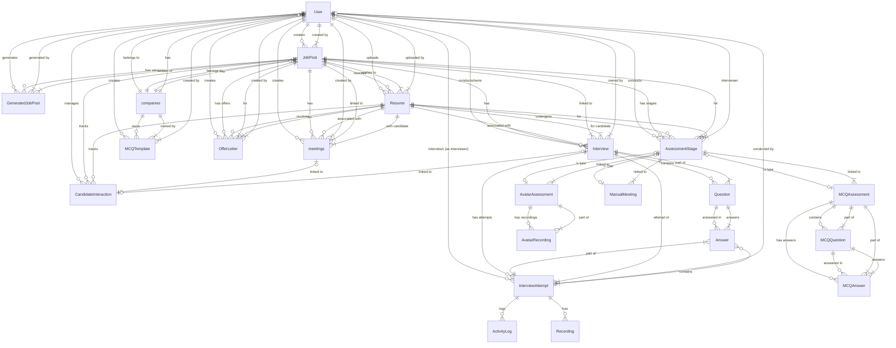

# Entity Relationship Diagram (ERD)

## Detailed Schema Description

### Core Entities
- **User**: System users (Admin, Manager, Company User). Links to Company.
- **companies**: Organization entity. Contains Users and Job Posts.
- **JobPost**: The central entity for hiring. Specific to a Company and User.
- **Resume**: Candidate profiles linked to a specific Job Post.

### Interactions & Workflow
- **CandidateInteraction**: A legacy unified table tracking interactions (Meetings, AI Interviews, Exams).
- **AssessmentStage**: The **new** unified assessment system. It tracks the stage of a candidate (MCQ, Avatar, Manual) for a specific Job/Resume.
    - **MCQAssessment**: Specific details for MCQ stages.
    - **AvatarAssessment**: Specific details for AI Avatar interview stages.
    - **ManualMeeting**: Specific details for human-led meetings.

### Interview & Testing
- **Interview**: Defines an interview session (questions, duration).
- **Question**: Questions within an interview.
- **InterviewAttempt**: An instance of a candidate taking an interview.
    - **Answer**: Responses to questions.
    - **ActivityLog**: Anti-cheat and system logs (tab switch, etc.).
    - **Recording**: Video/Audio recordings of attempts.

### MCQ System (Detailed)
- **MCQTemplate**: A bank of reusable questions owned by a company/user.
- **MCQQuestion**: Questions specific to an assessment instance.
- **MCQAnswer**: Candidate answers for MCQ assessments.

### Offer Management
- **OfferLetter**: Manages the final stage of hiring - generating and tracking job offers.

### System & Logging
- **ApiLog**: Logs of API function calls.
- **SystemConfig**: Dynamic system configuration.
- **AuditLog**: Security and action auditing.
