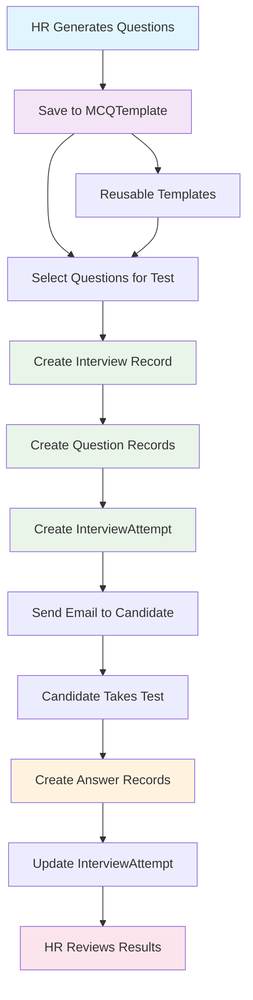

# 🎯 MCQ Assessment System - Complete Workflow Story

_A comprehensive guide to how the MCQ system works from question generation to candidate evaluation_

---

## 📋 Table of Contents

1. [System Overview](#system-overview)
2. [Database Schema](#database-schema)
3. [The Complete MCQ Story](#the-complete-mcq-story)
4. [Database Operations Flow](#database-operations-flow)
5. [API Endpoints Journey](#api-endpoints-journey)
6. [Data Relationships](#data-relationships)
7. [Visual Workflow Diagram](#visual-workflow-diagram)

---

## 🏗️ System Overview

The MCQ Assessment System is a comprehensive solution that allows HR professionals to:

- **Generate** MCQ questions using AI
- **Save** questions as reusable templates
- **Create** custom assessments for candidates
- **Send** test invitations via email
- **Track** candidate performance and results

---

## 🗄️ Database Schema

### Core Tables

```sql
-- Question Templates (Reusable Question Bank)
MCQTemplate {
  id: String (Primary Key)
  question: String
  options: Json (Array of options)
  correctAnswer: String
  topic: String
  difficulty: Enum (EASY, MEDIUM, HARD)
  companyId: Int (Foreign Key)
  createdById: Int (Foreign Key)
  createdAt: DateTime
  updatedAt: DateTime
}

-- Interview Sessions (Test Instances)
Interview {
  id: String (Primary Key)
  title: String
  description: String
  duration: Int (minutes)
  status: Enum (DRAFT, PUBLISHED, COMPLETED)
  candidateEmail: String
  sessionPassword: String
  jobPostId: String (Foreign Key)
  resumeId: String (Foreign Key)
  userId: Int (Foreign Key)
  createdAt: DateTime
  updatedAt: DateTime
}

-- Individual Questions in a Test
Question {
  id: String (Primary Key)
  interviewId: String (Foreign Key)
  type: Enum (MULTIPLE_CHOICE)
  question: String
  options: Json (Array of options)
  correct: Json (Correct answer)
  points: Int
  order: Int
}

-- Test Attempts (Candidate Sessions)
InterviewAttempt {
  id: String (Primary Key)
  interviewerId: Int (Foreign Key)
  interviewId: String (Foreign Key)
  status: Enum (IN_PROGRESS, COMPLETED, ABANDONED)
  score: Float
  maxScore: Float
  timeSpent: Int (seconds)
  startedAt: DateTime
  submittedAt: DateTime
  completedAt: DateTime
  violations: Int
}

-- Candidate's Submitted Answers
Answer {
  id: String (Primary Key)
  interviewAttemptId: String (Foreign Key)
  questionId: String (Foreign Key)
  answer: Json (Candidate's answer)
  isCorrect: Boolean
  pointsEarned: Float
  answeredAt: DateTime
}
```

---

## 📖 The Complete MCQ Story

### 🎬 Chapter 1: The Question Generation

**The Setting:** HR Manager Sarah wants to create an MCQ test for JavaScript developers.

**The Action:**

1. Sarah opens the MCQ creation page
2. She enters topics: `["JavaScript", "React", "Node.js"]`
3. She sets difficulty: `"Medium"`
4. She requests: `10 questions`

**Behind the Scenes:**

```javascript
// API Call to External AI Service
POST https://ai.synchro-hire.com/generate-mcq-questions
{
  "topics": ["JavaScript", "React", "Node.js"],
  "difficulty": "Medium",
  "number_of_questions": 10
}
```

**The Response:**

```json
{
  "success": true,
  "questions": [
    {
      "question": "What is the purpose of the useReducer() hook in React?",
      "difficulty": "Medium",
      "options": [
        "A. To manage local component state",
        "B. To handle complex state logic with reducers",
        "C. To replace useState hook",
        "D. To manage global application state"
      ],
      "topic": "React",
      "answer": "B. To handle complex state logic with reducers"
    }
    // ... 9 more questions
  ]
}
```

### 🎬 Chapter 2: Saving Questions as Templates

**The Action:**
Sarah decides to save these questions as reusable templates for future use.

**Database Operations:**

```sql
-- Each question gets saved individually in MCQTemplate table
INSERT INTO MCQTemplate (
  id, question, options, correctAnswer, topic,
  difficulty, companyId, createdById, createdAt, updatedAt
) VALUES
(
  'cmgmntp7w0001t1ef2bg4951p',
  'What is the purpose of the useReducer() hook in React?',
  '["A. To manage local component state", "B. To handle complex state logic with reducers", "C. To replace useState hook", "D. To manage global application state"]',
  'B. To handle complex state logic with reducers',
  'React',
  'MEDIUM',
  1, -- Sarah's company ID
  1, -- Sarah's user ID
  NOW(),
  NOW()
),
-- ... 9 more INSERT statements for other questions
```

**The Result:**

- ✅ 10 individual questions saved in `MCQTemplate` table
- ✅ Each question is reusable across different job positions
- ✅ Questions are company-specific (only Sarah's company can see them)

### 🎬 Chapter 3: Creating a Custom Assessment

**The Setting:** Sarah wants to send a test to candidate John for a "Senior React Developer" position.

**The Action:**

1. Sarah opens the "Saved MCQs" modal
2. She selects 5 questions from her saved templates
3. She chooses the job: "Senior React Developer"
4. She selects candidate: John (resumeId: `cmfhvue210001t1sbw43fk2lb`)

**Database Operations:**

```sql
-- Step 1: Create Interview Record
INSERT INTO Interview (
  id, title, description, duration, status,
  candidateEmail, sessionPassword, jobPostId, resumeId, userId,
  createdAt, updatedAt
) VALUES (
  'cmgne9vsh000ht1bvi7ko3e8m',
  'MCQ Assessment - 5 Questions - John Doe',
  'MCQ test with 5 questions',
  15, -- 15 minutes duration
  'PUBLISHED',
  'john.doe@email.com',
  'ABC123', -- Random session password
  'cmfh4uvvt0001t1eii1xqison', -- Job ID
  'cmfhvue210001t1sbw43fk2lb', -- Resume ID
  1, -- Sarah's user ID
  NOW(),
  NOW()
);

-- Step 2: Create Question Records (5 questions)
INSERT INTO Question (
  id, interviewId, type, question, options, correct, points, "order"
) VALUES
(
  'q1_id',
  'cmgne9vsh000ht1bvi7ko3e8m',
  'MULTIPLE_CHOICE',
  'What is the purpose of the useReducer() hook in React?',
  '["A. To manage local component state", "B. To handle complex state logic with reducers", "C. To replace useState hook", "D. To manage global application state"]',
  'B. To handle complex state logic with reducers',
  1,
  1
),
-- ... 4 more INSERT statements for other questions

-- Step 3: Create Interview Attempt
INSERT INTO InterviewAttempt (
  id, interviewerId, interviewId, status, score, maxScore,
  timeSpent, startedAt, violations
) VALUES (
  'attempt_id',
  1, -- Sarah's user ID as interviewer
  'cmgne9vsh000ht1bvi7ko3e8m',
  'IN_PROGRESS',
  0,
  5, -- Max score = number of questions
  0, -- Time spent in seconds
  NOW(),
  0 -- Violations count
);
```

**The Result:**

- ✅ 1 `Interview` record created
- ✅ 5 `Question` records created (linked to interview)
- ✅ 1 `InterviewAttempt` record created
- ✅ Email sent to John with test link and password

### 🎬 Chapter 4: The Candidate Takes the Test

**The Setting:** John receives the email and decides to take the test.

**The Action:**

1. John clicks the test link
2. He enters the session password: `ABC123`
3. He starts answering the 5 questions
4. He submits his answers

**Database Operations:**

```sql
-- Step 1: Update Interview Attempt (when John starts)
UPDATE InterviewAttempt
SET startedAt = NOW()
WHERE id = 'attempt_id';

-- Step 2: Insert Answers (when John submits)
INSERT INTO Answer (
  id, interviewAttemptId, questionId, answer, isCorrect,
  pointsEarned, answeredAt
) VALUES
(
  'answer1_id',
  'attempt_id',
  'q1_id',
  'B. To handle complex state logic with reducers',
  true, -- Correct answer
  1.0, -- Points earned
  NOW()
),
(
  'answer2_id',
  'attempt_id',
  'q2_id',
  'A. Wrong answer',
  false, -- Incorrect answer
  0.0, -- No points earned
  NOW()
),
-- ... 3 more INSERT statements for other questions

-- Step 3: Update Interview Attempt (when John completes)
UPDATE InterviewAttempt
SET
  status = 'COMPLETED',
  submittedAt = NOW(),
  completedAt = NOW(),
  score = 3.0, -- 3 correct answers out of 5
  timeSpent = 720 -- 12 minutes in seconds
WHERE id = 'attempt_id';
```

**The Result:**

- ✅ 5 `Answer` records created (one per question)
- ✅ `InterviewAttempt` updated with final score and timing
- ✅ John's performance is now tracked in the database

### 🎬 Chapter 5: HR Reviews the Results

**The Setting:** Sarah wants to review John's performance.

**The Action:**

1. Sarah opens the MCQ page
2. She expands the "Senior React Developer" job
3. She clicks "View Details" on John's interview
4. She sees all questions with color-coded results

**Database Query:**

```sql
-- Get complete interview details with answers
SELECT
  i.id as interview_id,
  i.title,
  i.candidateEmail,
  i.sessionPassword,
  ia.status as attempt_status,
  ia.score,
  ia.maxScore,
  ia.timeSpent,
  ia.submittedAt,
  q.id as question_id,
  q.question,
  q.options,
  q.correct,
  q.points,
  q."order",
  a.answer as candidate_answer,
  a.isCorrect,
  a.pointsEarned,
  a.answeredAt
FROM Interview i
JOIN InterviewAttempt ia ON i.id = ia.interviewId
JOIN Question q ON i.id = q.interviewId
LEFT JOIN Answer a ON q.id = a.questionId AND ia.id = a.interviewAttemptId
WHERE i.id = 'cmgne9vsh000ht1bvi7ko3e8m'
ORDER BY q."order" ASC;
```

**The Result:**

- ✅ Sarah sees all 5 questions
- ✅ Green borders for correct answers (3 questions)
- ✅ Red borders for incorrect answers (2 questions)
- ✅ Complete performance metrics and timing

---

## 🔄 Database Operations Flow

### Phase 1: Question Generation & Storage

```
External AI API → MCQTemplate Table
     ↓
10 questions saved individually
     ↓
Each question becomes reusable template
```

### Phase 2: Test Creation

```
MCQTemplate (5 selected) → Interview Table
     ↓                    ↓
Interview Record    →    Question Table (5 records)
     ↓                    ↓
InterviewAttempt → Ready for candidate
```

### Phase 3: Test Execution

```
Candidate Takes Test → Answer Table
     ↓
5 answer records created
     ↓
InterviewAttempt updated with results
```

### Phase 4: Results Review

```
HR Views Results → Join Query
     ↓
Interview + Questions + Answers
     ↓
Complete performance overview
```

---

## 🌐 API Endpoints Journey

### 1. Question Generation

```
POST /api/assessments/mcq/generate
→ Calls External AI API
→ Returns generated questions
```

### 2. Save Templates

```
POST /api/assessments/mcq/save
→ Saves questions to MCQTemplate table
→ Returns saved question IDs
```

### 3. Get Templates

```
GET /api/assessments/mcq/templates
→ Fetches company-specific templates
→ Returns available questions for selection
```

### 4. Send Test

```
POST /api/interview/send-mcq-test
→ Creates Interview record
→ Creates Question records
→ Creates InterviewAttempt record
→ Sends email to candidate
```

### 5. View Results

```
GET /api/interviews?includeQuestions=true
→ Fetches interviews with questions and answers
→ Returns complete assessment data
```

---

## 🔗 Data Relationships

### Primary Relationships

```
Companies (1) → (many) MCQTemplate
Users (1) → (many) MCQTemplate
Users (1) → (many) Interview
JobPost (1) → (many) Interview
Resume (1) → (many) Interview
Interview (1) → (many) Question
Interview (1) → (many) InterviewAttempt
InterviewAttempt (1) → (many) Answer
Question (1) → (many) Answer
```

### Data Flow Relationships

```
MCQTemplate → Question (Copy operation)
Interview → Question (Direct relationship)
InterviewAttempt → Answer (Direct relationship)
Question → Answer (Direct relationship)
```

---

## 📊 Visual Workflow Diagram



---

## 🎯 Key Benefits of This Architecture

### 1. **Reusability**

- Questions saved in `MCQTemplate` can be reused across different jobs
- No need to regenerate questions for similar positions

### 2. **Flexibility**

- HR can select any combination of questions
- Different difficulty levels for different roles
- Custom test durations

### 3. **Traceability**

- Complete audit trail from generation to completion
- Track candidate performance over time
- Identify knowledge gaps

### 4. **Scalability**

- Company-specific question isolation
- Support for multiple interviewers
- Easy to add new question types

### 5. **Performance Tracking**

- Detailed timing information
- Score calculations
- Violation tracking for integrity

---

## 🚀 Future Enhancements

### Potential Additions

1. **Question Categories**: Group questions by skill level
2. **Adaptive Testing**: Adjust difficulty based on performance
3. **Bulk Operations**: Send tests to multiple candidates
4. **Analytics Dashboard**: Performance trends and insights
5. **Question Bank Management**: Import/export functionality

---

_This comprehensive workflow ensures that every MCQ assessment is properly tracked, stored, and analyzed, providing HR teams with the tools they need to make informed hiring decisions._
